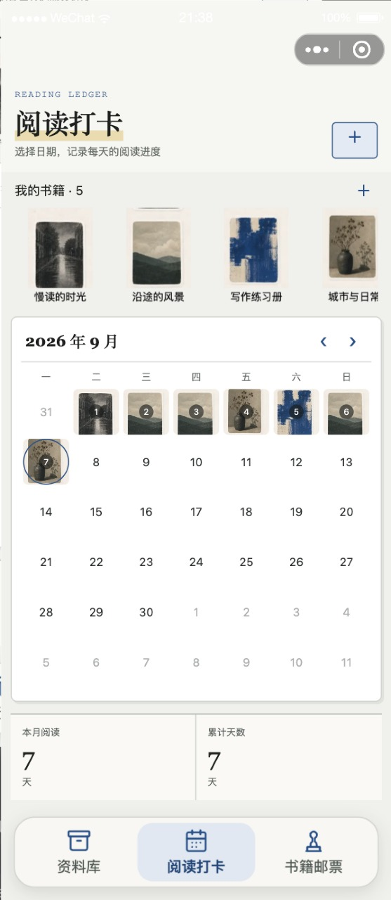
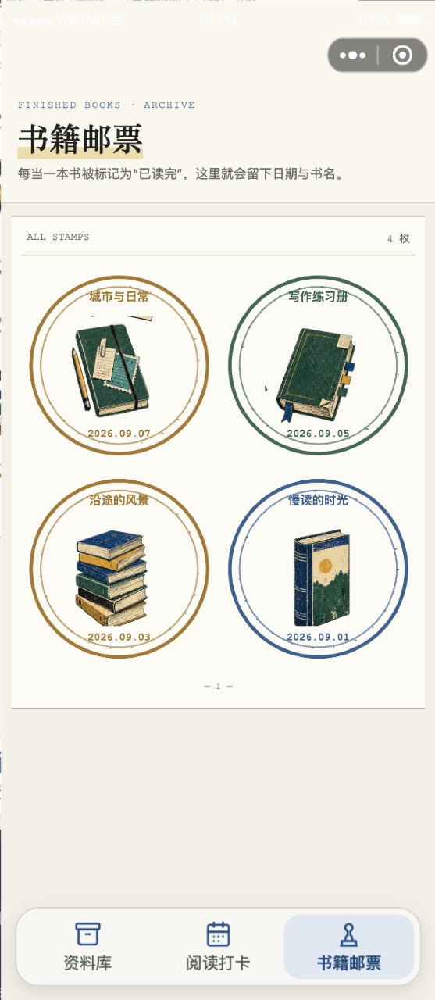

# LayReader (WX-miniprogram)

**Build a private knowledge library from your reading. Make the habit worth returning to.**

**从阅读中建立自己的私人知识库，让每一次阅读都有积累，也有乐趣。**

[English](#english) · [中文](#中文) · [Development / 开发](#development--开发)

## In the App / 界面预览

<table>
  <tr>
    <th width="33%">Library<br>资料库</th>
    <th width="33%">Reading Check-ins<br>阅读打卡</th>
    <th width="33%">Book Stamps<br>书籍邮票</th>
  </tr>
  <tr>
    <td><a href="docs/images/library.jpg"></a></td>
    <td><a href="docs/images/checkins.jpg"></a></td>
    <td><a href="docs/images/stamps.jpg"></a></td>
  </tr>
  <tr>
    <td>Keep ideas within reach.<br>整理摘录，让思考有迹可循。</td>
    <td>Give each reading day a place.<br>用剪贴日历，留下阅读足迹。</td>
    <td>Turn finished books into keepsakes.<br>读完一本，收藏一枚邮票。</td>
  </tr>
</table>

Actual simulator screenshots with fictional demo data. Select an image to view it full-size.<br>
真实模拟器截图，使用虚构示例数据。点击图片可查看原图。

## English

### Product Positioning

LayReader is a lightweight WeChat Mini Program for readers who want more than a collection of saved excerpts. It brings reading material, personal interpretation, book profiles, and reading history into one personal knowledge library.

Paper books and digital reading do not have to stay in separate worlds. Import a photo of a book page or a screenshot from another reading platform, extract its text with OCR, correct it, and turn it into an editable entry. Organize what matters with folders, colored tags, search, and book associations, then revisit and develop those ideas over time.

Alongside that library, a visual reading calendar and collectible completion stamps make habit-building more playful. The goal is not simply to count pages, but to make the relationship between reading, remembering, and creating visible.

### Product Highlights

- **A library shaped by your reading.** Collect excerpts and original writing in a searchable archive. Two-level folders, favorites, colored tags, and book-linked entries help turn isolated fragments into a reusable personal collection.
- **Lightweight digitization with OCR.** Import book-page photos or screenshots of reading material. The cloud OCR pipeline prefers detected highlighted or underlined text and falls back to the full recognized text. Review and correct the draft before confirming it; the source image stays out of the article body. OCR requires cloud setup and recognition quality varies by image.
- **One editor for every source.** Write directly or continue editing recognized text with the same native rich-text editor. Formatting appears immediately; supported controls include headings, font sizes, bold, italic, lists, quotes, images, and undo/redo. Local autosave helps preserve work between visits.
- **Reading check-ins with personality.** Record the date, book, pages, minutes, and reading status. Select a cover-style clipping for each book and see it appear on the calendar. Records remain editable, and page ranges can calculate how much you read.
- **A small reward for finishing.** Mark a book as finished to earn a book stamp with its title, completion date, and dedicated illustration. Vintage ink-style rings and collage artwork give the reading history a personal, collected feel. Stamps are derived from completion records, not stored as separate rewards.
- **Book profiles that connect the pieces.** Keep the author, total pages, clipping, reading progress, associated entries, and check-in history together. Move from a book to what you have read and written about it.
- **Local-first, cloud-optional.** The demo works with a versioned local cache. CloudBase synchronization, queued retries, and article conflict copies are implemented for a configured deployment. Local-only data is not automatically shared between devices.

### Scope and Current Status

This repository contains a working native Mini Program prototype, not a published or independently security-audited production service. Its three main spaces are **Library**, **Reading Check-ins**, and **Book Stamps**.

The local demo supports the library, editing, book profiles, reading records, and stamp workflows. Cloud sync and Tencent Cloud OCR have implementation code but require your own AppID, CloudBase environment, permissions, deployed functions, and OCR credentials before end-to-end use. Cross-platform capture means manually importing photos, screenshots, or PDFs; it does **not** mean automatic account synchronization, URL extraction, or scraping other reading apps. PDFs retain an original-file viewer; PDF OCR is not implemented.

There are no subscriptions, video imports, AI Assistant, or DeepSeek dependency. OCR is provided by Tencent Cloud, not a language-model chat assistant.

## 中文

### 产品定位

LayReader 是一个轻量化的微信阅读小程序，面向希望把阅读真正转化为个人积累的读者。它不只保存摘录，而是把阅读材料、自己的理解、书籍档案与阅读历程连接起来，逐步建立可检索、可编辑、可持续补充的私人知识库。

纸质阅读与电子阅读不必各自分散。拍下书页，或导入其他阅读平台的内容截图，通过 OCR 提取文字，修正后整理成可编辑的文章。再借助目录、彩色标签、搜索和书籍关联，将零散片段变成日后可以重新找到、继续思考和创作的材料。

与此同时，带有剪贴图的阅读日历和读完一本书后获得的书籍邮票，让习惯养成多一点趣味。它关注的不只是读了多少页，更是让阅读、记忆与表达之间的积累变得可见。

### 产品亮点

- **从摘录走向私人知识库。** 阅读摘录与自己的写作进入同一个档案袋，通过两级目录、收藏、彩色标签和全文搜索整理；文章可以关联书籍，让零散内容有出处，也有再次使用的机会。
- **轻量化电子化纸质与跨平台内容。** 导入书页照片或阅读截图，云端 OCR 优先提取检测到的高亮、划线内容，未检测到时回退到识别全文。用户修正并确认草稿后才进入正式正文，识别原图不会混入文章。OCR 需要配置云服务，效果受图片质量影响。
- **不论来源，都能继续编辑。** 自己输入的内容与 OCR 文字使用同一个原生富文本编辑器，支持标题、字号、加粗、斜体、列表、引用、插图及撤销／重做。格式即时呈现，本地自动保存帮助保留写作进度。
- **用打卡趣味化阅读习惯。** 记录日期、书籍、页数、时长和阅读状态，为每本书选择剪贴图，并在日历上留下对应图案。记录支持修改和删除，也可以通过起止页码计算阅读量。
- **读完一本书，获得一枚邮票。** 完成记录会自动生成带书名、完成日期和独立书籍插图的邮票。复古油墨圆环与剪贴风格，让阅读历程更有收藏感；修改完成状态时，邮票也会相应更新。
- **围绕一本书连接记录与思考。** 书籍档案汇总作者、总页数、剪贴图、阅读进度、关联文章与打卡历程，不必在分散的记录之间来回寻找。
- **本地优先，按需连接云端。** 演示模式使用版本化本地缓存；代码已包含配置 CloudBase 后的同步队列、重试和文章冲突副本机制。本地模式下，手机与电脑的数据不会自动互通。

### 功能边界与当前状态

本仓库是可运行的原生微信小程序原型，不是已正式发布或经过独立安全审计的线上服务。三个核心空间为 **资料库、阅读打卡、书籍邮票**。

本地演示可体验资料整理、富文本编辑、书籍档案、阅读记录和邮票流程。云同步与腾讯云 OCR 已有代码实现，但仍需配置自己的 AppID、CloudBase 环境、访问权限、云函数和 OCR 密钥后联调。“跨平台内容记录”指用户手动导入照片、截图或 PDF，不包含账号自动同步、URL 抓取或爬取其他阅读应用。PDF 保留原文件查看入口，尚不支持 PDF OCR。

项目不包含订阅、视频导入、AI Assistant，也不依赖 DeepSeek。文字识别由腾讯云 OCR 提供，而不是聊天助手。

## Development / 开发

### Repository Layout / 项目结构

```text
miniprogram/
  pages/                       Library, check-ins, stamps / 三个主页面
  package-content/pages/       Editor, import, book profiles / 分包页面
  components/stamp-canvas/     Canvas completion stamps / 完成邮票
  custom-tab-bar/              Bottom navigation / 底部导航
  domain/                      Library and reading rules / 领域逻辑
  services/                    Local repository and sync / 缓存与同步
  assets/                      Clippings and icons / 剪贴图与图标
cloudfunctions/
  libraryService/              Data operations / 数据操作
  extractOcr/                  Image preprocessing and OCR / 图像识别
tests/                         Domain and workflow tests / 自动化测试
docs/cloudbase-security.md     Deployment security guidance / 安全配置
```

### Local Demo / 本地演示

Use Node.js **22.18+** (or a newer supported release with built-in TypeScript stripping), npm, and WeChat DevTools. The Node test suite imports TypeScript directly; DevTools compiles the Mini Program client separately.

使用 Node.js **22.18+**（或支持内置 TypeScript 类型擦除的更新版本）、npm 和微信开发者工具。Node 测试直接导入 TypeScript；小程序客户端由开发者工具编译。

```bash
npm ci
npm run check
```

1. Import the repository root into WeChat DevTools. / 在开发者工具中导入仓库根目录。
2. The shared configuration uses `touristappid` and `__CLOUDBASE_ENV_ID__`; compile to run the local demo. / 仓库使用占位 AppID 和云环境 ID，编译后可运行本地演示。
3. For phone preview, configure your own registered AppID, sign in with an authorized developer account, then use **Preview** and scan with WeChat. / 手机预览需填写自己的已注册 AppID，使用有开发权限的账号登录后点击“预览”，再用微信扫码。

### Cloud Sync and OCR / 云同步与 OCR

1. Set your AppID in `project.config.json` and environment ID in `miniprogram/config/runtime.ts`. Do not commit your deployment-specific values. / 本地填写 AppID 和云环境 ID，不要提交个人部署配置。
2. Create six collections: `articles`, `folders`, `tags`, `books`, `reading_logs`, and `user_settings`. / 创建这六个集合。
3. Configure database and storage access rules using [the security guide](docs/cloudbase-security.md). Verify user isolation before importing private material. / 按安全说明配置数据库与存储权限，导入私人材料前验证用户隔离。
4. Deploy `libraryService` and `extractOcr` with cloud dependencies installed. / 部署两个云函数，并在云端安装依赖。
5. Enable Tencent Cloud OCR and set the following **only in the cloud-function environment**. / 开通腾讯云 OCR，以下变量**仅配置在云函数环境中**：

```text
TENCENTCLOUD_SECRET_ID
TENCENTCLOUD_SECRET_KEY
TENCENTCLOUD_REGION=ap-guangzhou
```

Cloud services may incur charges. OCR uploads the source image for cloud processing; this is not an entirely on-device or end-to-end encrypted workflow. / 云服务可能产生费用。OCR 需要上传原图进行云端处理，并非纯本机识别或端到端加密流程。

### Privacy and Verification / 去敏化与验证

- This is a clean Mini Program source snapshot: no desktop prototype history, personal reading exports, account screenshots, real AppID, cloud environment ID, or credentials are included. / 本仓库为独立小程序源码快照，不包含旧桌面原型历史、个人阅读导出、账号截图、真实 AppID、云环境 ID 或密钥。
- Local environment files, private DevTools configuration, keys, logs, and exports are ignored. Tracked configuration files must still be reviewed before every push. / 已忽略本地环境文件、开发工具私有配置、密钥、日志及导出文件；已跟踪的配置文件仍需在每次推送前检查。
- `npm run check` runs domain/workflow tests and TypeScript checks. Cloud integration, iOS/Android behavior, package size, and production security require separate verification. / 此命令执行领域及交互流程测试和类型检查；云端联调、iOS/Android 真机、包体与生产安全需另行验证。
- Lucide icons retain their [upstream license](miniprogram/assets/icons/LICENSE). / Lucide 图标保留上游许可证。

Some internal identifiers retain the original `LazyReader` name for cache compatibility. / 部分内部标识保留原 `LazyReader` 名称，以兼容已有缓存。
